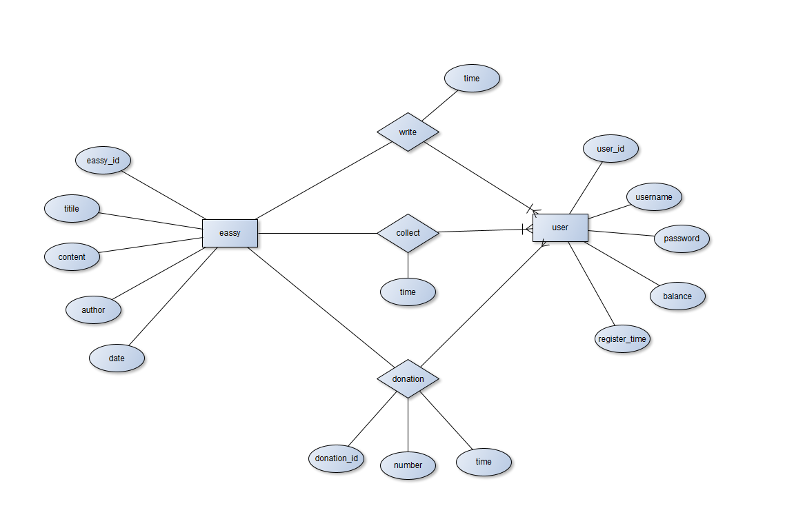

### 1. E-R图

### 2. 表设计

用户表(users)

| 字段          | 长度 | 类型      | PK/Fk/unique/!null | 备注 |
| ------------- | ---- | --------- | ------------------ | ---- |
| user_id       |      | serial    | PK & autoinc       |      |
| username      | 32   | varchar   | unique             |      |
| password      | 16   | varchar   | !n                 |      |
| balance       |      | real      | !n                 |      |
| register_time |      | timestamp | auto               |      |

文章表

(eassy)

| 字段      | 长度 | 类型    | PK/Fk/unique/!null | 备注 |
| --------- | ---- | ------- | ------------------ | ---- |
| eassy_id  |      | serial  | PK & autoinc       |      |
| title     |      | varchar | !n                 |      |
| contant   |      | varvhar | !n                 |      |
| author_id |      | serial  | FK (users.user_id) |      |

写作表

(write)

| 字段     | 长度 | 类型      | PK/Fk/unique/!null  | 备注 |
| -------- | ---- | --------- | ------------------- | ---- |
| user_id  |      | FK        | FK (users.user_id)  |      |
| eassy_id |      | FK        | FK (eassy.eassy_id) |      |
| time     |      | timestamp | auto                |      |

收藏表

(collet)

| 字段     | 长度 | 类型      | PK/Fk/unique/!null  | 备注 |
| -------- | ---- | --------- | ------------------- | ---- |
| user_id  |      | FK        | FK (users.user_id)  |      |
| eassy_id |      | FK        | FK (eassy.eassy_id) |      |
| time     |      | timestamp | auto                |      |

打赏表

(donation)

| 字段         | 长度 | 类型      | PK/Fk/unique/!null  | 备注 |
| ------------ | ---- | --------- | ------------------- | ---- |
| user_id      |      | FK        | FK (users.user_id)  |      |
| donate_eassy |      | FK        | FK (eassy.eassy_id) |      |
| number       |      | money     | !n                  |      |
| time         |      | timestamp | auto                |      |

